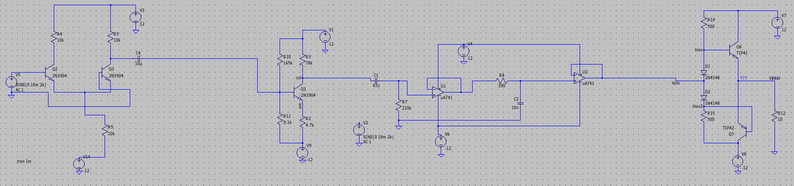

---
header-includes:
   - |
     ```{=latex}
     \usepackage{etoolbox}
     \usepackage{graphicx}
     \renewcommand{\arraystretch}{1.3}
     \makeatletter
     \makeatother
     ```
documentclass: report
---
\begin{titlepage}

    \centering
    \vspace{10cm}
	{\scshape\Large Electronics Workshop - 2 Course Project 1\par}
	\vspace{1cm}
	{\huge\bfseries Audio Amplifier Design\par}
																   \vspace{10cm}
    \vfill
	{\scshape\Large Team 14 \par}	
	\vspace{0.1cm}
	{\scshape\large L Lakshmanan (2020112024)\par}	
	\vspace{0.1cm}
	{\scshape \large Ananya Sane (2020102007)\par}
	\vfill

    {\large \today\par}
\end{titlepage}
\tableofcontents
\clearpage

---
geometry:
- top=35mm
- left=35mm
- right=35mm
- heightrounded
...


## 1. Introduction

The main objective of this project is to design a four stage audio amplifier circuit to drive a certain load while taking small audio signals as input. The audio amplifier design broadly includes four stages, which are as follows:

- Preamplifier stage: Directly connected to the microphone which takes the input signal and amplifies it to a certain level to make it resistant to noise, while also cancelling the input noise due to differential operation.

- Gain stage: This stage is where the voltage gain mainly happens with the signal from the preamplifier. Our main objective here is to amplify the voltage of the signal as much as possible without clipping or distortion.

- Active filter stage: This stage is used to filter out the frequencies above and below the specified range of operation and not attenuating the amplified signal in the required range. This is done by using an active bandpass filter circuit.

- Power amplifier stage: This stage is used to amplify the power of the signal to a level that can drive the output load, while maintaining the voltage gain from the previous stages. This is done by using a class AB power amplifier circuit.

All the amplifiers are implemented using BJTs. The simulations are done using LTSpice and the final results are verified using a breadboard circuit.

## 2. Required Specifications

The required specifications for the audio amplifier are as follows:

- Input voltage to the mic: 10-40mV peak to peak
- Input frequency: Audible range i.e. (20Hz-20KHz)
- Gain: > 500 (should be obtained only from Pre-amp and Gain stages)
- Power: > 1.5W
- Load: ~$10\Omega$ 

No clipping in the output signal is allowed. Gain should be almost constant for all frequencies in the specified band (audible range). The power amplifier stage should be able to drive the load with a voltage gain of 500.

## 3. Design Procedure

Each of the stages were designed individually, with calculated values which were then tweaked in the simulation according to the required specifications and the availability of components in the lab. The 2N3904 transistor were used for the voltage amplifier stages, while the LM741 was used for the buffer stages. The TIP31C and TIP32C were used in the power amplifier design.

### 3.1 Preamplifier Stage

The preamplifier stage is the first stage after the microphone, so it recieves the raw noisy small signal as input. We prefer a differntial amplifier due to its noise rejecting properties in the differential mode of operation, while also providing us a reasonable amount of gain. For a differential amplifier, we have

$$V_{emitter} \approxeq -0.7V$$

for both transistors, to ensure they are biased properly (input at 0V DC) so that the base-emitter junction is forward biased, while the collector emitter junction is reverse biased. We know that the equation for collector current of a BJT is

$$I_C = I_S \exp(V_{BE}/V_T)$$

$$I_E = \alpha I_C$$

$$\alpha = \frac{\beta}{\beta + 1} \approxeq 1$$

Assuming tail current to be $I_0$, we have

$$I_0 = I_{E1} + I_{E2}$$

let

$$V_d = V_{BE1} - V_{BE2}$$

which gives us

$$I_{E1} = \frac{I_0}{(1 + \exp(-V_d/V_T))}$$

$$I_{E2} = \frac{I_0}{(1 + \exp(V_d/V_T))}$$

and

$$I_C \approxeq I_E$$ 

as $\alpha \approxeq 1$. So, collector current is independent of the common mode voltage, which is the cause for common mode rejection.

As we are taking single ended output for the differential amplifier, we get half the gain, which gives us the gain equation

$$A_v = -\frac{g_mR_C}{2}$$

Assuming tail resistance is 10k and $V_{EE} = -12V$, we have

$$I_0 = \frac{12 - 0.7}{10k\Omega} = 1.13mA$$

Taking $R_C = 10k\Omega$ gives us the collector base junction in reverse bias ($V_{col} = 6.38V$ RMS).

The transconductance of our transistor can be calculated as

$$g_m = \frac{I_C}{V_T} = \frac{1.13mA/2}{26mV} = 0.0217S$$

So, we have our gain as

$$A_v = -\frac{g_mR_C}{2} = 108.6$$


As calculated, we observe a gain of around 102 in the simulation, which can be seen in the output plot (fig 2.) given below.


We observe a similar output in the hardware construction of the stage. The circuit and output are shown in the figures below.


\pagebreak

### 3.2 Gain Stage

For the gain stage, we have gone with a common emitter amplifier stage with degeneration. This stage has many benefits, a few of them being the simple design and higher linearity offered due to the degeneration resistance. The gain will drop as a result of the degeneration but in exchange for improved linearity.

We have the following equation for the gain of a CE stage with degeneration.

$$A_v = \frac{-g_mR_C}{1 + g_mR_E}$$

where $R_E$ is the degeneration resistance. Increasing it improves linearity but decreases gain.

As we have a gain of around 100 from the previous stage, we require a gain of at least 5 from this stage to achieve our target gain of 500.

Assuming $R_E = 5K\Omega$, we have

$$R_C \approxeq = 25k\Omega$$

for a gain of 5. We use a resistor of $110k\Omega$ to ensure the final gain is above our requirements even after gain drop in the power amplifier stage. We bias the base terminal to be at a lower voltage than the collector terminal voltage after $R_C$, while the base junction remains at a higher voltage than the emitter. We find biasing the base terminal at around -10.75V to provide the necessary conditions for active forward region operation. So, the resistors need to be in the ratio of 18.13:1 to get the bias voltage of -10.75 volts.

The final values in the circuit are obtained after manual tweaking in LTSpice. The circuit is shown below.


The output after both the preamplifier cascaded with the gain stage for a 20mV p-p signal is shown below.


We see a 14.1V p-p sinusoid as the output waveform, which corresponds to a gain of around 705 with both the stages combined.

\pagebreak

### 3.3 Active Filter Stage

We use an active bandpass filter stage with an operational amplifier as a unity gain buffer as the active component to give us a high input impedance and low output impedance buffer stage that allows for impedance matching and signal transfer without attenuation in the passband. The stage can be broken down into three blocks: a high pass filter, a unity gain buffer, and a low pass filter.

The filters we use are RC filters, and the cutoff frequency is calculated by using the formula

$$f_c = \frac{1}{2\pi RC}$$

We assume the cutoff frequencies to be slightly more than the band that we want to pass to allow a uniform gain across the entire passband. The high pass filter has a cutoff frequency of 16.1251Hz, while the low pass filter has a cutoff frequency of 40.8kHz.

The circuit is shown below.


The Bode plot of the entire amplifier till this point is shown below.


While this filter does let in frequencies slightly above 20kHz, we have done so to ensure that we observe a uniform gain over the passband. The waveform after the filter is not attenuated, as is seen in the image.


This is exactly what we want for a signal in the passband.

\pagebreak

### 3.4 Power Amplifier Stage


## 4. Final Results and Achieved Specifications

The final circuit diagram is shown below.



We have connected the stages using coupling capacitors where necessary, except for the power amplifier stage, where we use a buffer to provide a high input impedance (low current) with unity gain. As we can see, the final output waveform after the power amplifier stage gives us an output that is nearly 11.9V peak to peak, with an input waveform of 20mV peak to peak. So, the net gain of the entire audio amplifier circuit is

$$A_v = \frac{V_{out}}{V_{in}} = \frac{11.9}{0.02} = 595$$

We have thus fulfilled our objective for a voltage gain of greater than 500. The output power (RMS) of the circuit at the load, as seen from the simulation is around 1.8084W at 2kHz, which is also as per our requirements which states a power of greater than 1.5W. However, the output power does drop at higher frequencies. The input has been tested for waves from 10mV-30mV peak to peak, and from a frequency of 10Hz to 100kHz. The operation of the audio amplifier has been tested and verified within the specified conditions. The results of the circuit hardware are also in close accordance with the simulated and calculated results.

## 5. Conclusion

We have designed, simulated and constructed a functional audio amplifier circuit according to a set of given specifications.

---